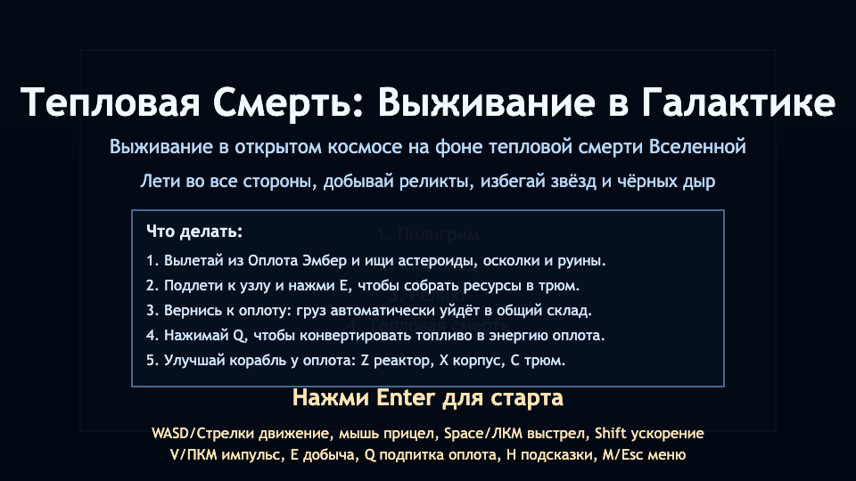
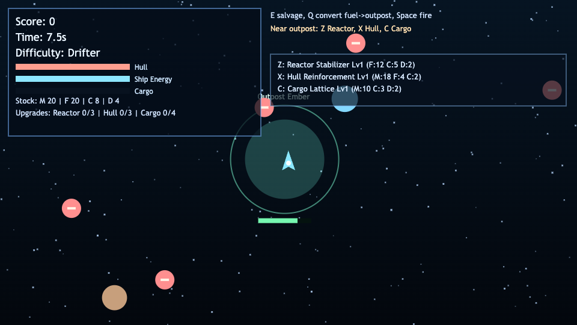

# Thermal Death: Galaxy Survival

2D open-space survival prototype set in a near-heat-death universe.

## Features
- Free-flight movement in all four directions with inertia.
- Deterministic chunk-based world generation.
- Resource scavenging from asteroids, shards, and wrecks.
- Hazards: suns and black holes.
- Hostile drones and lightweight combat.
- Outpost energy decay loop and resource deposit cycle.
- Difficulty presets: Pilgrim, Drifter, Relic, Heat Death.

## Controls
- `WASD` / Arrow keys: move
- `Shift`: low-thrust braking
- `Space`: fire
- `E`: salvage nearby resource node
- `Q`: convert outpost fuel to outpost energy (while near outpost)
- `Z`: buy Reactor upgrade at outpost
- `X`: buy Hull upgrade at outpost
- `C`: buy Cargo upgrade at outpost
- `1..4`: choose difficulty in menu
- `Enter`: start run
- `R`: restart after game over
- `F`: toggle fullscreen (`Esc` exits)

## Run
```bash
npm install
npm run start
```
Then open `http://127.0.0.1:4173`.

## Automation
`window.render_game_to_text()` and `window.advanceTime(ms)` are exposed for deterministic Playwright testing.

## Screenshots


